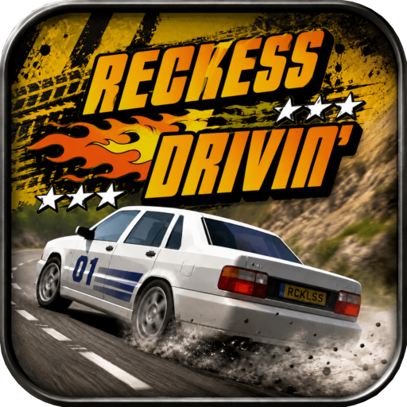

# reckless-drivin

 

FMI, see:

https://github.com/DarrCoh/reckless-drivin-sdl

https://jonasechterhoff.com/Reckless_Drivin.html

## Controls:

D-pad for steering, left stick for analog control, face buttons for actions, triggers for accelerate/brake, Options to quit.

### Menu Shortcuts

L1 + R1 for Level Select, Cross (X) to Register, Circle (O) to Quit, Triangle (△) for Help, Square (□) for High Scores, Options for Preferences, and Touchpad to Start the Game.
